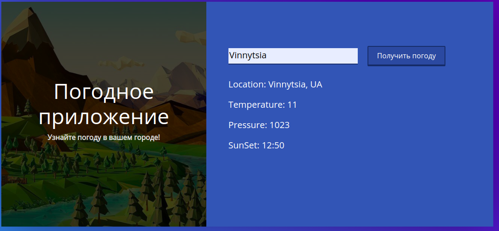
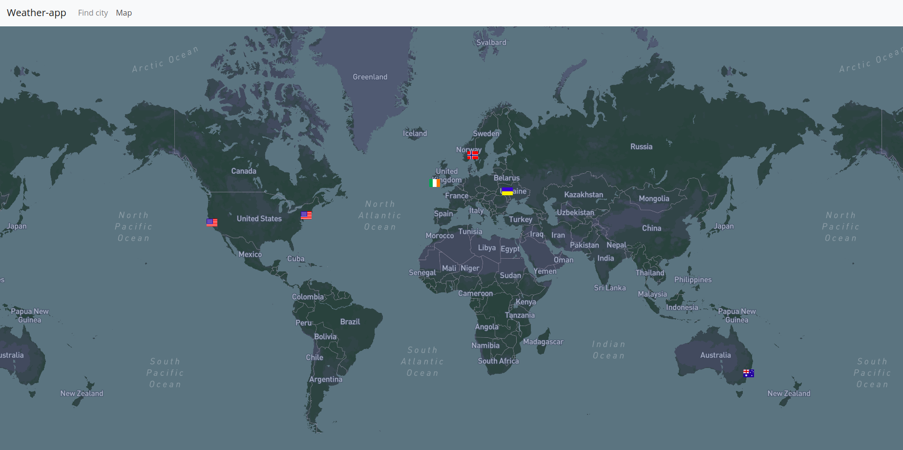

#Lab-2-3

Після завантаження репозиторію потрібно виконати npm install та npm install @nrwl/cli

Після завантаження пакетів виконуємо nx serve weather-app та nx serve weather-app-api в різних термінала
Аплікація буде доступна на localhost:4200

